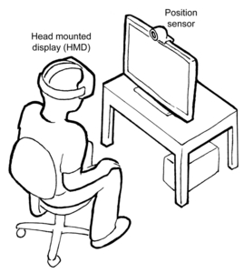
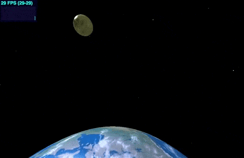
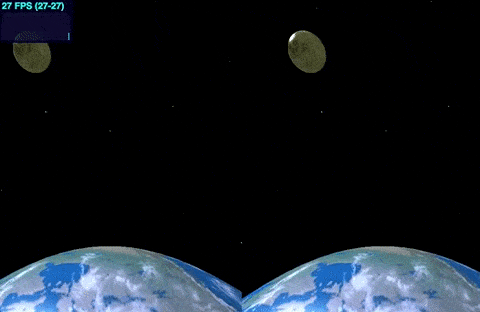
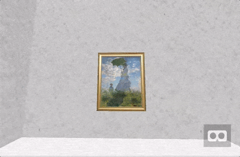
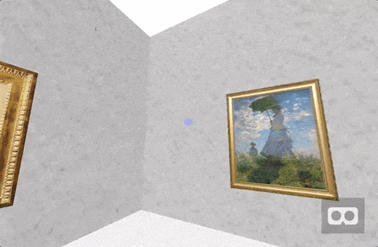

2016 was a year called the year of VR. In the autumn, PlayStation VR is released, and it is a VR showing excitement in various places, but that wave is also spreading on the web.
By using the WebVR API, which Mozilla VR team has been developing mainly, connecting a PC to a VR device will enable a VR experience on the browser.
Although VR contents such as OculusRift and Daydream are closed to each platform, by bringing the openness of the web, it becomes a bridge of more media, becoming a part to play a part as VR penetrates I think whether it is.I would like to touch on parts such as WebVR and its implementation approach and VR content interactions in this article.

***

## How browser VR works

Briefly explaining the mechanism of the browser VR, by opening a browser corresponding to WebVR and connecting the head mounted display (HMD), the content on the browser is displayed on the HMD, and it is linked with the direction of the face and the position of the head Then the content is displayed.

<figure>
	
	<figcaption>from https://developer.mozilla.org/ja/docs/Web/API/WebVR_API</figcaption>
</figure>

However, since HMD is expensive, if you are experiencing VR easily, it would be a good idea to look it up on a smartphone using Google Cardbord etc.

## WebVR API

WebVR API has become Editor 's Draft in W3C, and the specification is currently being developed.  
[https://w3c.github.io/webvr/](https://w3c.github.io/webvr/)

#### Available browsers(2016/12)

- Chrome experimental builds 
(https://webvr.info/get-chrome/)
- Firefox Nightly Builds
- Samsung Internet Browser for GearVR

In September of this year Edge has also announced a policy to support WebVR.

#### Interface

Using the WebVR API, you can do the following things.

- Get VR device information ([HMDVRDevice](https://developer.mozilla.org/ja/docs/Web/API/HMDVRDevice))
- Get position of VR device ([PositionSensorVRDevice](https://developer.mozilla.org/ja/docs/Web/API/PositionSensorVRDevice))
- Get Events of VR device ([onvrdisplayconnected](https://developer.mozilla.org/ja/docs/Web/API/Window/onvrdisplayconnected), [onvrdisplaydisconnected](https://developer.mozilla.org/ja/docs/Web/API/Window/onvrdisplaydisconnected), [onvrdisplaypresentchange](https://developer.mozilla.org/ja/docs/Web/API/Window/onvrdisplaypresentchange))
- Get drawing assistance information ([VREyeParameters](https://developer.mozilla.org/en-US/docs/Web/API/VREyeParameters))

As you can see, it is an API that mainly gets VR device information.
It is the job of content implementers to create a VR experience using this information.

## Implementation approach

Let's look at a concrete implementation method. Below is a rough flow.

1. WebGL drawing on the Canvas element using Javascript and creating 3D contents
2. Acquire VR device location information using WebVR API
3. Adapt the acquired position information to the position information of the camera in 3D contents
4. Drawing processing of left eye / right eye screen (screen divided into 2 for VR)
5. Repeat steps 2 to 4 with requestAnimationFrame

We will make 3D space on the browser with WebGL, but if you implement it from scratch it will cost a lot of learning cost, so use 3D graphics drawing library such as Three.js.
In the repository of Three.js, there are convenient VR modules called VRControls and VREffect, which automatically perform 2 and 4 processing.

**VRControls.js**  
Link the position information of the VR device with the camera position in 3D space  
https://github.com/mrdoob/three.js/blob/dev/examples/js/controls/VRControls.js

**VREffect.js**  
Divide the screen into two, and calculate the difference of drawing processing for left eye and right eye for stereoscopic viewing 
https://github.com/mrdoob/three.js/blob/dev/examples/js/effects/VREffect.js

## Typical library / framework

There seem to be lots of libraries and frameworks for creating WebVR content, so I tried to summarize representative ones.

**WebVR Boilerplate**  
VR compatible 3D content implemented in Three.js.  
URL: https://github.com/borismus/webvr-boilerplate

**A-Frame**  
Create VR content in HTML tag format.  
URL: https://aframe.io/

**Solufa**  
Create VR content using Virtual DOM. It is said to be faster than A-Frame.  
URL: http://solufa.io/

**Vizor**  
Can create and publish VR space, 360° content on the browser.  
URL: http://vizor.io/

**InstaVR**  
Can create 360° contents with navigation and information on the browser.  
URL: http://jp.instavr.co/

In this article, I would like to make content using WebVR Boilerplate, A-Frame from among these.

## WebVR Boilerplate

WebVR Boilerplate is a library for VR compatibility of 3D contents created with Three.js.
Actually, it is a module named VRManager, which can do full screen correspondence of the contents and 2 division correspondence of the screen from the icon in the lower right.

First I tried to make a simple 3D content sample using Three.js.

Here is the [**sample**](https://shiruco.github.io/WebVR_Sample/three/).
<figure>
	
</figure>

source is **[here](https://github.com/shiruco/WebVR_Sample/blob/master/three/src/app.js)**

But this is just only 3D content, so I'd like to use VR to comply with WebVR Boilerplate and jump into the universe.

First npm install webvr-boilerplate.

```
npm install webvr-boilerplate
```

Install polyfill to use WebVR.

```
npm install webvr-polyfill
```

In addition, load VRControls.js and VREffect.js.

```
import 'webvr-polyfill';
import WebVRManager from 'webvr-boilerplate';
import VRControls from './modules/VRControls';
import VREffect from './modules/VREffect';
```

We are now ready to support VR.
After that, I will implement it using the loaded module, but if you scratch only the points and write it, initialize each module first,

```
// init VRControls
const controls = new VRControls(camera);

// init VREffect
const effect = new VREffect( renderer );
// for screen division
effect.setSize(window.innerWidth, window.innerHeight);

// init VRManager
const manager = new WebVRManager(renderer, effect);
```

It recalculates position information at the timing of requestAnimationFrame and redraws the screen. That's it, it's simple.

```
// update location information of VRControls
controls.update()

// redraw with VRManager
manager.render( scene, camera )
```

Here is what I completed with the above implementation.

Here is the [**sample**](https://shiruco.github.io/WebVR_Sample/three_demo/).
<figure>
	
</figure>

source is **[here](https://github.com/shiruco/WebVR_Sample/blob/master/three_vr/src/app.js)**

If you use Google Cardbord etc, the camera will move according to your head position, you can experience as if you are there.

## A-Frame

By using A-Frame, you can create VR content in HTML format.
Also, because it corresponds to WebVR by default, it can be developed without being conscious of VR correspondence.
Detailed specifications are written in the official document, so please refer.

I made a sample similarly.

Here is the [**sample**](https://shiruco.github.io/WebVR_Sample/aframe/).
<figure>
	
</figure>

source is **[here](https://github.com/shiruco/WebVR_Sample/blob/master/aframe/index.html)**

Without writing a line of Javascript, I was able to make something like an Impressionist painter's museum.

What I did is add various nodes such as `<a-entity>` and `<a-plane>` to `<a-scene>` which is the parent of all elements and set the position information and texture to the node's attribute value.

Let's add an interaction element to this content.

### Intaraction

When considering interaction with VR content, the following things are candidates on the operation side.

- Viewpoint cursor
- Controller (Gamepad etc)

We accept user actions using these, but in WebVR I think that there are only a few people who can prepare the controller as well as the HMD, so I think personal viewpoint cursor will become mainstream .

### Cursor Component

The viewpoint cursor is implemented with the cursor component of A-Frame.
Cursor has a property named fuse. This flag is whether or not to issue a click event to the object on the view cursor. However, if you just set this to true, we will fire every clicking event on every object that intersects the viewpoint, so we will issue it by gazing at the time specified by the timeout property.
The following example is set to 3 seconds.

```
<a-entity camera look-controls>
    <a-entity cursor="fuse: true; timeout: 3000;" position="0 0 -2"
                    geometry="primitive: ring; radiusOuter: 0.05; radiusInner: 0; segmentsTheta: 45"
                    material="color: #A6AAF4">
    </a-entity>
</a-entity>
```

In addition, there are `mouseenter` which fires when cursor gets on the object, `mouseleave` which fires when leaving, and uses these to create interactive contents.

So, here is the sample.

Here is the [**sample**](https://shiruco.github.io/WebVR_Sample/aframe_interaction/).
<figure>
	
</figure>

source is **[here](https://github.com/shiruco/WebVR_Sample/blob/master/aframe_interaction/index.html)**

A viewpoint cursor (thin purple circle) is displayed at the center of the screen.
When the cursor rides on the painting, the explanation panel is displayed,
If you keep staring at it for 3 seconds, a dummy menu will come up.
In this sample I do not have anything to stare at the menu, but it seems to be more interesting if I can link to the next content and next content by clicking (gazing) the menu.

***


This time I wrote with the feeling that it is wide and shallow from WebVR specification to implementation. It is an impression that I actually made the content, but it is an impression that if it is convenient to use the library, it is surprisingly easy to make something like that. Especially for A-Frame etc, people without knowing Javascript can make VR contents if there is only HTML knowledge.
Although it does not correspond to graphics made with Unity or UnrealEngine, it seems that it is possible to make contents making use of the strengths of the web.
Following Google's "VR Shell," WebVR browser for Facebook VR browser "Carmel", WebVR development "React VR" announcement, next year will be even more exciting.
I would like to focus on that trend in the future.

